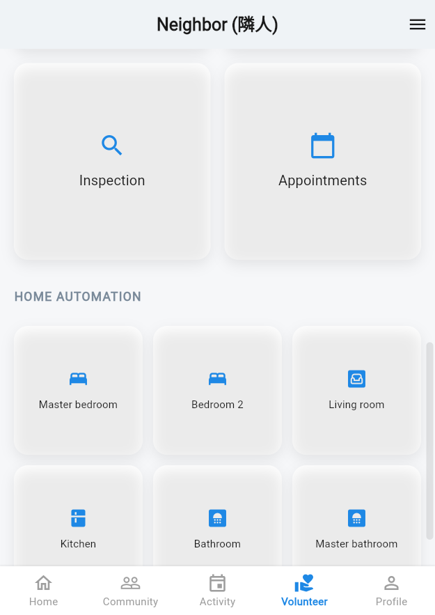

# ICPC-2025 Monorepo

<div align="center">


<br/>



<p>Backend (Next.js + Prisma + MySQL) and Frontend (Flutter) for the ICPC 2025 project.</p>

[Quick Start](#quick-start) • [Architecture](#architecture) • [Backend](#backend) • [Frontend](#frontend) • [Scripts](#scripts) • [Contributing](#contributing)

</div>

---

## Quick Start

```bash
# clone
git clone https://github.com/MrPusitCH/ICPC-2025.git
cd ICPC-2025

# Backend
cd backend
cp env.example .env
npm install
npm run prisma:generate
npm run prisma:migrate
npm run dev

# Frontend (new terminal)
cd ../frontend/application_icpc
flutter pub get
flutter run
```

---

## Architecture

```text
ICPC-2025/
├─ backend/                     Next.js 15 API + Prisma + MySQL
│  ├─ src/app/api/...           REST endpoints
│  ├─ prisma/                   schema & migrations
│  └─ public/                   static assets
└─ frontend/
   └─ application_icpc/         Flutter application
      ├─ lib/                   features, widgets, services
      └─ build/                 build outputs (gitignored)
```

---

## Backend

Next.js 15 API with Prisma ORM and MySQL.

- Setup: see [`backend/README.md`](backend/README.md)
- Env: copy `backend/env.example` to `.env`
- Dev: `npm run dev` at `backend/`

Key endpoints (examples):

- `POST /api/auth/register`
- `POST /api/auth/login`
- `POST /api/auth/logout`
- `GET  /api/profile`

---

## Frontend

Flutter multi-platform app.

- Setup: see [`frontend/README.md`](frontend/README.md)
- Dev: `flutter run` at `frontend/application_icpc/`
- API integration file: `lib/services/api_service.dart` (currently uses mock data)

### Animation ideas
- Shimmer placeholders for lists
- Button micro-interactions on tap
- Page transitions on route changes

---

## Scripts

From repo root:

```bash
# Backend
cd backend && npm run dev

# Frontend
cd frontend/application_icpc && flutter run
```

---

## Contributing

1. Fork → feature branch → PR
2. Keep accessibility in mind for elderly users
3. Update docs when changing features

---

## License

MIT


